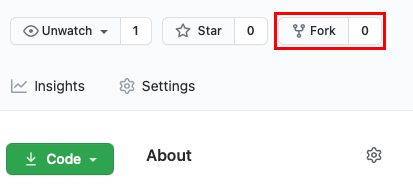
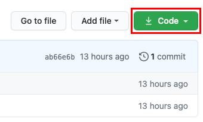
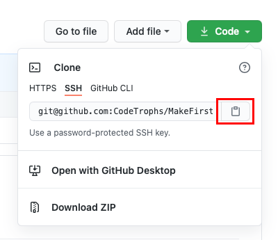
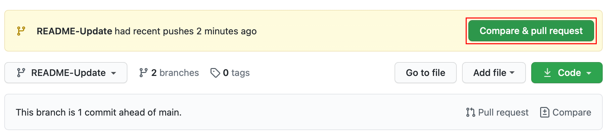
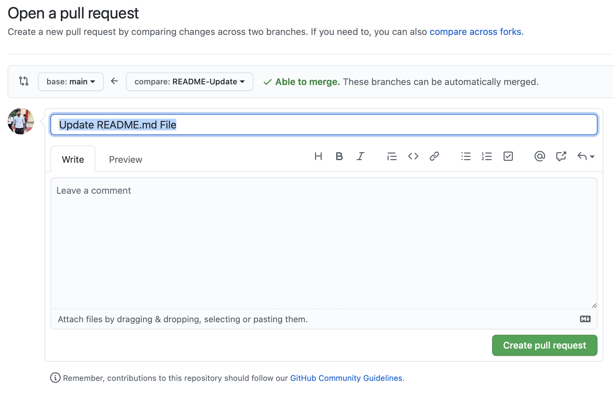

<h1 align="center">Make First PR</h1>
<p align="center"> </p>

<p align="center"> </p>

[](https://github.com/CodeTrophs/MakeFirstPR/issues)


[](https://github.com/CodeTrophs/MakeFirstPR/blob/main/LICENSE)

### ✨ Feel free to submit a pull request with your suggestions of MakeFirstPR🚀

## First Contributions

This project aims to simplify and guide the way beginners make their first contribution. If you are looking to make your first contribution, follow the steps below.

#### If you don't have git on your machine, [install it](https://help.github.com/articles/set-up-git/).

## Fork this repository

Fork this repository by clicking on the fork button on the top of this page.
This will create a copy of this repository in your account.

<p align="center">  </p>


## Clone the repository

Now clone the forked repository to your machine. Go to your GitHub account, open the forked repository, click on the code button and then click the _copy to clipboard_ icon.

<p align="center">  </p>

Open a terminal and run the following git command:

```
git clone git@github.com:CodeTrophs/MakeFirstPR.git
```

<p align="center">  </p>

## Create a branch

Change to the repository directory on your computer (if you are not already there):

```
cd MakeFirstPR
```

Now create a branch using the `git checkout` command:

```
git checkout -b username
```

For example:

```
git checkout -b aryasoni98
```

(The name of the branch does not need to have the word _add_ in it, but it's a reasonable thing to include because the purpose of this branch is to add your name to a list.)

## Make necessary changes and commit those changes

If you go to the project directory and execute the command `git status`, you'll see there are changes.

Add those changes to the branch you just created using the `git add` command:

```
git add file-name
```

Now commit those changes using the `git commit` command:

```
git commit -m "Add <file-name>"
```

replacing `<file-name>` with your name.

## Push changes to GitHub

Push your changes using the command `git push`:

```
git push origin <add-your-branch-name>
```

replacing `<add-your-branch-name>` with the name of the branch you created earlier.


## Submit your changes for review

If you go to your repository on GitHub, you'll see a `Compare & pull request` button. Click on that button.



Now submit the pull request.



Soon I'll be merging all your changes into the master branch of this project. You will get a notification email once the changes have been merged.
